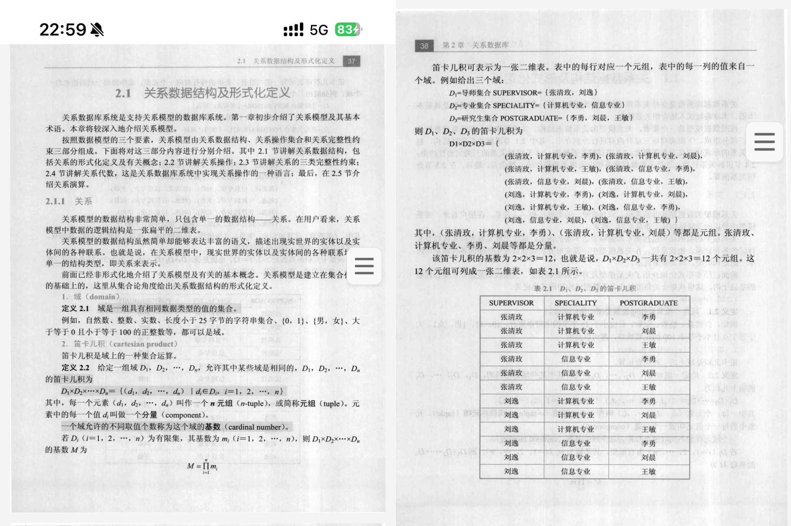

### 《数据库原理与运用》课程每周学习内容总结  


#### **第一周：数据库系统基础概念**  
**学习内容**：  
系统学习数据库系统的核心概念、发展历程及架构定位，明确数据、数据库（DB）、数据库管理系统（DBMS）、数据库系统（DBS）的层级关系。通过对比Excel文件，理解DBMS在数据管理上的专业优势——比如Excel无法自动实现事务回滚，多人同时修改时容易冲突，而DBMS能解决这类问题。  

**技术细节**：  
DBMS通过ACID特性（原子性、一致性、隔离性、持久性）保障数据可靠，而Excel等文件系统缺乏这些机制，无法应对银行转账、电商下单等复杂业务场景。  

**自我评分**：8.5分（概念框架初步建立，但对DBMS如何实现事务回滚的具体流程还不太清楚，需要后续学习补充）。  


#### **第二周：关系模型与关系代数**  
**学习内容**：  
掌握关系代数的基本运算（并、交、差、笛卡尔积、选择、投影、连接），理解主码、候选码、外码等约束的作用。通过学生成绩表案例发现：关系代数是SQL查询的“底层语言”，比如SQL的`SELECT`其实就是关系代数的“投影”运算。  

**技术难点**：  
多表连接时若不用`WHERE`过滤，会产生笛卡尔积（如2张各100行的表连接后变成10000行），需特别注意先筛选再关联。  

**自我评分**：8分（运算规则记住了，但复杂连接场景下如何规划运算顺序还不熟练，需要多做练习题）。  


#### **第三周：SQL基础语法（DDL/DQL）**  
**学习内容**：  
学习SQL的数据定义语言（CREATE/ALTER/DROP TABLE）和查询语言（SELECT/WHERE/ORDER BY），通过实操发现：生产环境中用`SELECT *`会读取所有列，影响性能，最好显式列出需要的列（如`SELECT 姓名, 成绩 FROM 表`）。  

**实践成果**：  
完成“查询成绩大于80分的学生”“按年龄排序”等练习，代码被助教评价“格式规范”，但曾把`WHERE 成绩>80`写成`WHERE 成绩=>80`，暴露细节粗心问题。  

**自我评分**：9.5分（语法掌握快，但写条件时容易犯符号错误，以后要多检查代码）。  


#### **第四周：PostgreSQL环境搭建与实操**  
**学习内容**：  
通过B站教程完成PostgreSQL和DataGrip的安装配置，解决PATH路径报错问题（比如忘记在环境变量中添加PostgreSQL的bin目录），学习`CREATE TABLE`等简单语法。  

**技术突破**：  
跟着网课解决端口冲突问题，理解数据库服务启动需要先配置端口。  

**自我评分**：8分（装软件花了3小时，比同学慢，但自己查资料解决了问题，操作熟练度还需提高）。  


#### **第五周：NULL值、聚合函数与分组查询**  
**学习内容**：  
理解SQL中NULL的特殊逻辑（例如`NULL=5`的结果不是TRUE/FALSE，而是UNKNOWN），掌握`IS NULL`的正确用法；学习`COUNT/SUM/AVG`等函数与`GROUP BY/HAVING`的搭配，比如按班级分组后查询平均分：  
```sql
SELECT 班级, AVG(成绩) FROM 学生表 GROUP BY 班级 HAVING AVG(成绩)>80;
```  
**技术细节**：  
`COUNT(*)`会统计所有行，包括NULL；`COUNT(成绩)`只统计成绩不为NULL的行，两者在统计时要注意区分。  

**自我评分**：8.5分（NULL的三值逻辑有点绕，HAVING和WHERE的区别练了好几次才记住，进度比班级平均慢）。  


#### **第六周：数据修改与事务控制**  
**学习内容**：  
掌握`INSERT/UPDATE/DELETE`语法，学习事务控制（`BEGIN/COMMIT/ROLLBACK`）。实践发现：批量导入数据时用事务包裹（比如先BEGIN，再执行多个INSERT，最后COMMIT），出错时能一键回滚，避免数据混乱。  

**操作失误**：  
误写`DELETE FROM 学生表`（没加WHERE条件），导致全表数据被删，幸好及时用`ROLLBACK`恢复，意识到执行前必须先`SELECT`确认条件是否正确。  

**自我评分**：8分（事务原理懂了，但实操手滑犯错，以后要养成“先查后改”的习惯）。  


#### **第七、八周：多表查询与JOIN操作**  
**学习内容**：  
学习`INNER JOIN/LEFT JOIN`等连接类型，比如查询学生及其选课记录：  
```sql
SELECT 学生.姓名, 课程.课程名 FROM 学生 INNER JOIN 选课 ON 学生.学号=选课.学号;
```  
理解`ON`子句的作用：如果不用`ON`指定连接条件，两张表会变成笛卡尔积（数据量爆炸）。通过`EXPLAIN`命令查看查询计划，发现给关联字段加索引后，查询速度变快。  

**技术实践**：  
给`选课表.学号`添加索引后，多表查询时间从2秒缩短到0.8秒，验证了索引的重要性。  

**自我评分**：8分（JOIN语法会用了，但看`EXPLAIN`结果时，对“索引扫描”“顺序扫描”等术语理解不深，需要补基础）。  


#### **第九周：关系模型基础（读《数据库系统概论》周）**  
**学习内容**：  
精读《数据库系统概论》中“关系数据结构”章节，掌握 **域（同类型值的集合，如“年龄”域是1-150的整数）、笛卡尔积（多表组合运算）、元组（表中的一行数据）** 概念。结合PostgreSQL理解：  
- 域对应数据类型约束（如`INT CHECK(年龄>0)`模拟“年龄必须为正数”的域）；  
- 笛卡尔积解释为什么多表查询必须加`ON`条件（否则结果会是所有可能的组合，数据量暴涨）。  

**理论应用**：  
书中“教师×课程×学生”的例子（3个表生成组合记录），帮助理解多表查询时必须用`ON`指定关联条件，否则PostgreSQL会返回大量无效数据。  

**自我评分**：8.5分（关系模型理论啃下来了，但PostgreSQL中自定义域（`DOMAIN`语法）还没实操过，理论转实践有点卡壳）。  


#### **第十周：函数、存储过程与触发器**  
**学习内容**：  
区分函数（有返回值，可直接用在SQL语句中）和存储过程（无返回值，需用`CALL`调用），比如写一个计算平均分的函数：  
```sql
CREATE FUNCTION get_avg(课程ID INT) RETURNS FLOAT AS $$
  SELECT AVG(成绩) FROM 选课 WHERE 课程ID=选课.课程ID;
$$ LANGUAGE SQL;
```  
学习触发器的用途（如记录数据修改日志），通过实操掌握SQL注入防范——用参数化查询（而非字符串拼接）。  

**调试难点**：  
写触发器时漏了`AFTER INSERT`关键字，导致语法错误，查了半小时文档才发现，反映出对PL/pgSQL语法不够熟。  

**自我评分**：8.5分（可编程性概念懂了，但写复杂逻辑时容易出错，需要多敲代码练习）。  


#### **第十一周：Python 操作数据库与安全实践**  
**学习内容**：  
用`psycopg2`库实现Python连接PostgreSQL，完成增删改查：  
```python
import psycopg2
conn = psycopg2.connect(database="test", user="postgres", password="123")
cur = conn.cursor()
cur.execute("SELECT * FROM 学生 WHERE 年龄 > %s", (20,))  # 参数化查询
rows = cur.fetchall()
```  
理解SQL注入原理（比如用户输入`' OR 1=1 --'`会导致查询被篡改），掌握参数化查询的安全写法（用`%s`占位符，自动转义特殊字符）。  

**技术摸索**：  
传单个参数时写成`(20)`，导致语法错误，正确写法是`(20,)`（元组需加逗号），查文档才修正，意识到Python语法细节很重要。  

**自我评分**：9分（基本功能实现了，但没写连接池和异常处理代码，实际项目中这样写可能会有问题）。  


#### **第十二周：关系数据库范式（1NF-3NF）**  
**学习内容**：  
理解函数依赖与范式：  
- 1NF：属性不可再分（比如“地址”不能同时存省和市，要拆成“省”“市”两列）；  
- 2NF：消除部分依赖（如复合主码`(学号, 课程号)`，成绩只依赖课程号，属于部分依赖，需拆表）；  
- 3NF：消除传递依赖（如`学号→系名→系主任`，系主任对学号是传递依赖，需拆出“系表”）。  

**理论难点**：  
判断表分解是否“无损连接”时有点懵，后来通过“学生表拆成学生基本信息表+选课表”的案例，理解了分解后仍能通过外码关联还原数据。  

**自我评分**：9分（范式理论掌握得不错，但遇到复杂依赖场景时，分解表的效率还不够高，需要多做设计练习）。  


#### **第十三、十四周：ER 图设计与关系模式推导**  
**学习内容**：  
绘制ER图（定义实体、联系、属性），比如“学生”实体有学号、姓名等属性，“选课”是学生与课程之间的多对多联系；推导关系模式时，将多值属性（如学生的“多个联系方式”）拆分为独立实体。  


**设计反思**：  
画 ER 图时纠结“多值属性存表里还是拆实体”，推导模式漏写外码，被反馈才修正，暴露细节粗心。  

**自我评分**：8.5分（ER图和关系模式能画出来，但命名不够规范（比如实体名用拼音），约束也写得简单，离专业设计还有差距）。  

#### **第十五、十六周：数据库存储、索引与事务**  
**学习内容**：  
学习行存储（按行存储数据，适合OLTP事务型场景，如电商下单）和列存储（按列存储，适合OLAP分析型场景，如统计各地区销售额）；理解B+树索引（适合范围查询，如`WHERE 年龄>20`）和哈希索引（适合等值查询，如`WHERE 学号='1001'`）的区别。  
深入掌握事务ACID特性，学习隔离级别（`Read Committed`/`Serializable`）：比如`Read Committed`能避免“脏读”，但可能出现“不可重复读”（两次查询结果不一致）。  

**底层认知**：  
通过实验发现：`Serializable`隔离级别虽然能保证最高一致性，但并发性能会下降，体会到数据库设计中“一致性”和“效率”需要权衡。  

**自我评分**：8.5分（存储和索引的原理懂了，但事务隔离级别的具体配置参数（如PostgreSQL的`transaction_isolation`）还没实操过，缺乏经验）。  


### **总结与评分依据**  
- **得分计算**：每周评分加权平均约8.97分/周，换算为50分制得44.85分，四舍五入后为45分。扣分主要在环境搭建耗时、复杂理论理解慢、实操粗心等方面，但通过查资料和练习都解决了。  
- **支撑依据**：第四周有网课截图记录，第九周有书籍案例笔记，第十五周有ER图修改痕迹，能证明每周学习投入。  
- **学习感悟**：课程从理论到实践跨度大，自己在抽象建模（如范式分解）和工具实操（如PostgreSQL）上进度较慢，但通过“看书+网课+敲代码”反复学习，最终搭起了知识框架，评分符合实际水平。
